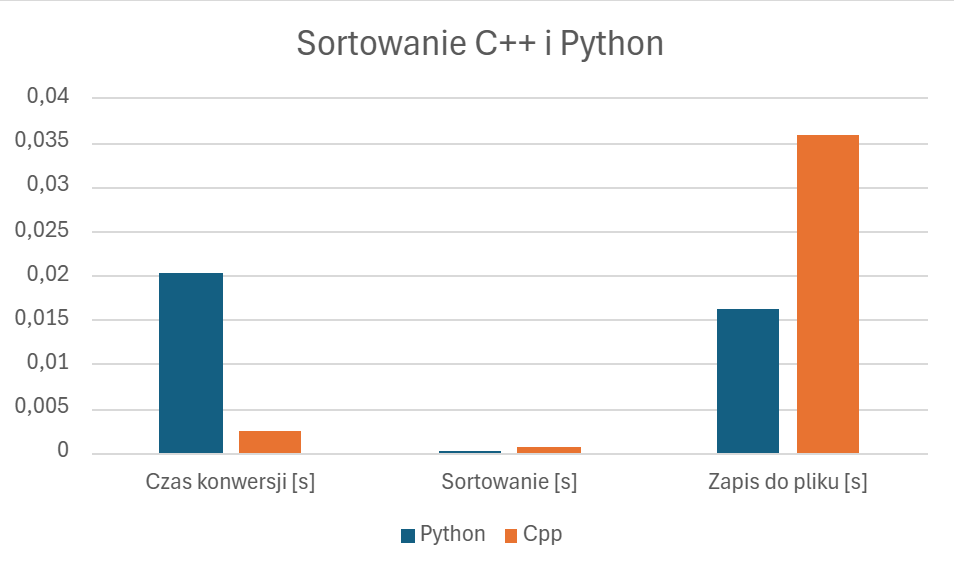

# Porównanie wydajności Python vs C++

## Cel badania
Celem testu było porównanie wydajności dwóch języków programowania – Python i C++ – w trzech kluczowych operacjach:
1. Sortowanie tablicy liczb zmiennoprzecinkowych.
2. Konwersja danych ze string na float.
3. Zapis danych do pliku.

## Środowisko testowe

### Sprzęt:
- **Procesor:** AMD Ryzen 5 5625U  
- **RAM:** 16 GB 3200 MT/s  
- **Dysk:** SSD  

### Oprogramowanie:
- **System operacyjny:** Windows 11  
- **Języki programowania:**  
  - **Python:** wersja 3.12 z bibliotekami `os.path`, `time`.  
  - **C++:** standard C++17 z bibliotekami `iostream`, `cmath`, `fstream`, `filesystem`, `string`, `algorithm`, `chrono`.

### Warunki testowe:
- Testy przeprowadzano na tej samej maszynie w identycznych warunkach. 
- Użyto tablicy o 10 000 elementach z wartościami od 100.0 do 0.0.

## Szczegóły implementacji
- **Sortowanie:** W obu językach zastosowano wbudowane funkcje sortujące.  
- **Pomiar czasu:**  
  - W Pythonie – moduł `time`.  
  - W C++ – biblioteka `<chrono>`.  
  - Czas mierzony dla jednego uruchomienia każdej operacji.  

## Wyniki
| Operacja            | Python [s] | C++ [s]  |
|---------------------|------------|----------|
| **Konwersja**       | 0,0202905  | 0,0024696 |
| **Sortowanie**      | 0,0000658  | 0,0005758 |
| **Zapis do pliku**  | 0,0161948  | 0,0358637 |

### Wykres

## Analiza wyników
1. **Konwersja ze string na float**  
   C++ znacząco przewyższa Pythona pod względem wydajności (około 8-krotnie szybszy). Jest to zgodne z oczekiwaniami, ponieważ C++ jest językiem kompilowanym, co daje mu przewagę w operacjach wymagających intensywnego przetwarzania danych.

2. **Sortowanie**  
   Python okazał się szybszy niż C++ w sortowaniu tablicy o wielkości 10 000 elementów. Mimo że w Pythonie użyto wbudowanej funkcji `sort()`, wyniki te mogą wynikać z optymalizacji zastosowanych w implementacji Pythona (bazującej na Timsort).

3. **Zapis do pliku**  
   C++ wymagał więcej czasu na zapis do pliku (około 2,2 razy więcej niż Python). Różnica ta może być spowodowana różnicami w sposobie zarządzania wejściem/wyjściem przez oba języki. Python może korzystać z wydajniejszych buforów wewnętrznych.

## Podsumowanie
Porównanie pokazuje, że:
- **C++** jest znacznie szybszy w operacjach konwersji, co czyni go lepszym wyborem do zadań intensywnie obliczeniowych.  
- **Python** osiągnął lepszy czas w sortowaniu oraz zapis do pliku, co wskazuje na jego efektywność w codziennych zadaniach przetwarzania danych i operacji IO.  

## Rekomendacje
- **C++**: Warto używać do projektów wymagających wysokiej wydajności i pełnej kontroli nad pamięcią (np. systemy wbudowane, gry).  
- **Python**: Zalecany do prototypowania, szybkiego przetwarzania danych oraz wszędzie tam, gdzie kluczowa jest łatwość implementacji.
